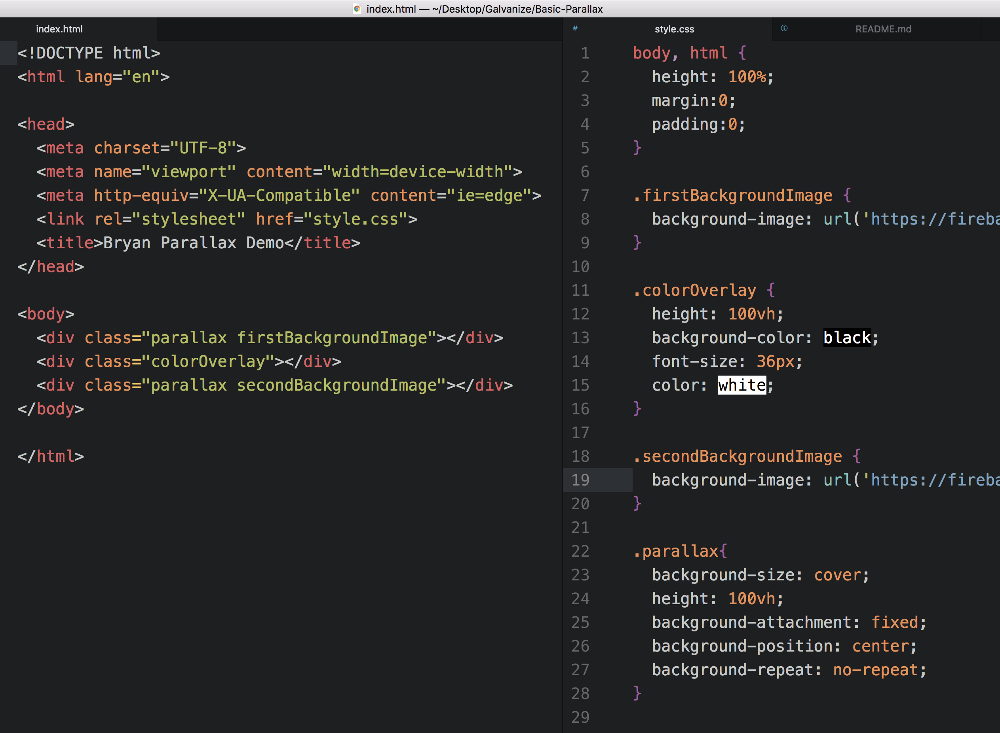

# Bryan's Parallax Demonstration

## What is it?

This code adds basic parallax to a site. Specifically, it slides a colored overlay on top of two static background images which change as the user scrolls.

## See the live version at my [hosted website.](https://bryan-paralla.firebaseapp.com/)

## The Code - HTML

In the HTML document, add two DIVs which will hold background images and a DIV that will hold the colored overlay. It is important to place the DIVS in your HTML in the following order:

- FirstBackgroundImage
- coloredOverlay
- SecondBackgroundImage

## The Code - CSS

Set your background image URLs and give them the following attributes:

- background-size: cover
- height: 100vh
- background-attachment: fixed
- background-position: center
- background-repeat: no-repeat

Give your colored overlay a height of 100vh and then style it as you see fit.

Feel free to look at my code! All images copyright Bryan Long.

## Why The Code Works

- In the HTML we have three DIVs that are styled to each be as tall as the browser's viewheight (100VH).
- If you comment out the "background-attachment: fixed" style on the background images, this gives us three images we can scroll through.
- Applying a fixed position to the background-attachment attribute on both images sets those two images to remain in place in the browser window. When the user scrolls, the color overlay moves through the images, replacing one background with another.

## The Code

